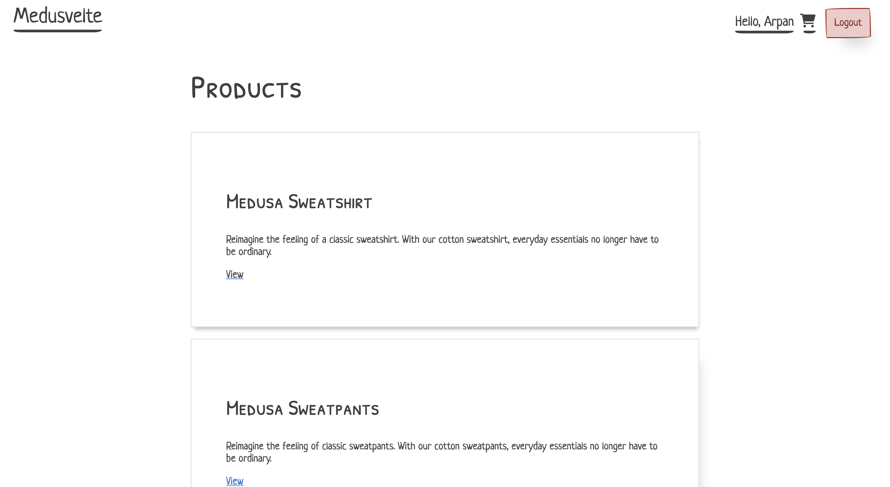

# Medusa-Svelte Quickstarter


## About

### Participants

In this section, include the GitHub handles of everyone in your team, including yourself.

Please also share their Twitter and Discord handles as it makes it easier for us to make shout-outs and contact you in case your project ends up as a winner.

### Description

It is a quickstarter for [Medusa](https://medusajs.com) with [Svelte](https://svelte.dev) as the frontend framework. It is very basic but you need to start somewhere :wink: . It is enough to get your projects started. It is also a good example of how to use Medusa with Svelte.

### Preview

Some screenshots are attached below:





## Set up Project

First install the dependencies as described below, then run the development server:

```bash
yarn dev
```

Or build the project:

```bash
yarn build
```

and start the server:

```bash
yarn start
```

### Prerequisites

These are the prerequisites you need to install the project and run it properly.

Examples of Prerequisites:

- Medusa Server (Link to [Quickstart](https://docs.medusajs.com/quickstart/quick-start) here).
- Create an account with [Stripe](https://stripe.com).

### Install Project

Follow the steps below to install the project:

For example:

1. Clone the repository:

```bash
git clone https://github.com/Arpan-206/medusa-svelte
```

2. Change directory and install dependencies:

```bash
cd medusa-svelte
yarn install
```

## Resources

These resources may help you get started with Medusa easily:

For example:

- [Medusa’s GitHub repository](https://github.com/medusajs/medusa)
- [How to Add Stripe](https://docs.medusajs.com/add-plugins/stripe/)
- [Svelte Kit](https://kit.svelte.dev/)